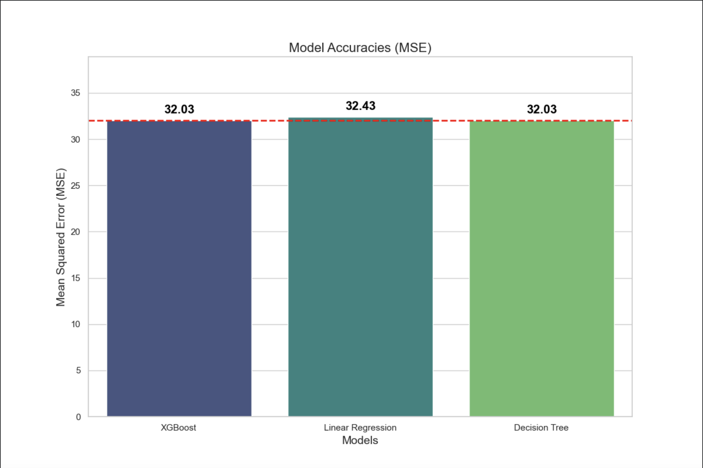

# SneakerPrice Project


Documentation of my Final project

Useful pages
https://whimsical.com/U88m7uXKkKf9sbXyAWZN7D
https://duckdb.org/

## Step 1
Import all my fuctions into the main file
```py
from scraper import scrape_sneakers
from functions.remove_rename_add_columns import remove_rename_add_data_cols
from functions.detect_brand import detect_brands
from functions.detect_collab import celebs, add_collaboration
from functions.detect_sneaker_dicount_tag import fix_sneaker_discount
```
## Step 2
Scrape goat.com website using requests.
```py
scraped_sneakers = scrape_sneakers('sneakers', 'testing_steps/sneakers_data.json')
print(f"Scraped {len(scraped_sneakers)}")
```
## Step 3
Remove and add values to my json file based on my needs
```py
remove_rename_add_data_cols('testing_steps/sneakers_data.json')
```
## Step 4
Using the name of the sneakers and an arrays with keywords extract the brand of the sneaker.
```py
detect_brands('testing_steps/sneakers_data.json', 'testing_steps/sneakers_data.json')
```
## Step 5
Same as Step 4 but now using an array of celebrities that used to be associated with sneakers, extract collaborations
```py
number, sneakers_with_collab = add_collaboration('testing_steps/sneakers_data.json', 'testing_steps/sneakers_data.json')
print(number)
print(f"Processed {len(sneakers_with_collab)}")
```
## Step 6
Fix empty discount tags by looping over the shoes and checking if their price is higher/lower than the retail price
```py
fix_sneaker_discount('testing_steps/sneakers_data.json', 'testing_steps/sneakers_data.json')
```

## Step 7
Reformat the raw sneaker data for modeling
```py
refractor_data('testing_steps/sneakers_data.json', 'testing_steps/sneakers_data.json')
```

## Step 8
Extract relevant features for model training
```py
get_data_for_model('testing_steps/sneakers_data.json', 'testing_steps/data_for_model.json')
```

## Step 9
Split the data into training and testing sets
```py
get_training_and_testing_data('testing_steps/data_for_model.json', 'testing_steps/train_data.json', 'testing_steps/test_data.json')
```

## Step 10
Prepare data for making predictions
```py
get_data_to_predict('testing_steps/sneakers_data.json', 'testing_steps/data_to_predict.json')
```

## Step 11
Run the model pipeline and generate predictions
```py
model_pipeline()
```

## Step 12
Merge the predicted release dates back into the original dataset
```py
update_release_dates('testing_steps/sneakers_data.json', 'testing_steps/data_predicted.json', 'testing_steps/sneakers_data.json')
```

## Step 13
Visualize model performance with a mean squared error (MSE) comparison
```py
models_mse = {
        'XGBoost': (None, 32.033138721185516),
        'Linear Regression': (None, 32.429062066651895),
        'Decision Tree': (None, 32.0331386834529)
    }
plot_model_accuracies(models_mse)
```

